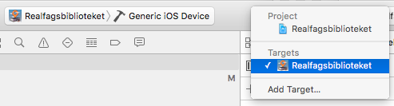
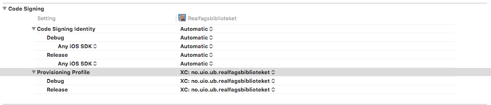

# realfagsbiblioteket-app

Ionic-based app (Android, iOs) for searching and navigating the UiO Science Library. The code is licensed under the MIT license, but not the icons (See the credits section below for info about the icons).

Former https://github.com/saqimtiaz/BibSearch/

## Server dependencies

- bibapp.biblionaut.net (just a proxy for lsm)
- lsm.biblionaut.net
- https://app.uio.no/ub/bdi/realfagsbiblioteket/status.php

## Development

[](https://www.codacy.com/app/danmichaelo/realfagsbiblioteket-app)
[](http://waffle.io/scriptotek/realfagsbiblioteket-app)

* To build for Android you need Java and Android Studio. Use the SDK manager to
  fetch a recent SDK. Remember to set the `ANDROID_HOME` environment variable.
* To build for iOS, you need the latest XCode and `npm install -g ios-sim ios-deploy`.

### Setup

* `npm install` to install deps
* `gulp install` to install frontend deps
* Install Scandit:
  * Since Scandit is not open source, we cannot distribute it on GitHub. Create an
  account at Scandit, download `scandit-barcodescanner-community-phonegap_4.11.0.zip`
  from https://ssl.scandit.com/account/sdk and unzip it in the root project folder.
  * `ionic plugin add scandit-barcodescanner-community-phonegap_4.11.0`
  * `cp config/env.dist.json config/env.json` and add your API key to the file.
* `gulp build` to build 'www/' from 'src/'.

### Some useful commands

* Run in browser:
  - `ionic serve` to start a dev server that serves files
  from `src/` (meaning you don't need to `gulp build` first => fast)

* Run on connected Android phone:
  - `adb devices` to check that device is found
  (remember to have USB debugging enabled)
  - `ionic run android --device`
  - Uninstall: `adb shell am start -a android.intent.action.DELETE -d package:no.uio.ub.realfagsbiblioteket`
  - Reset camera permission: `adb shell pm revoke no.uio.ub.realfagsbiblioteket android.permission.CAMERA`

* Run on emulated iPhone:
  - `ios-sim showdevicetypes` to list available devices
  - `ionic emulate --target="iPhone-4s" ios`
  - `ionic emulate ios --livereload --consolelogs --serverlogs`

Note that `ionic build` copies files from `www/` to the respective folders under `platforms/`.
The `hooks/before_prepare/020_gulp_build.js` hook makes sure `gulp build` is run before
preparing the platform files.

Updating icons & splash screen: See https://github.com/driftyco/ionic-cli/issues/1608

## Preparing a release

Remember to

- `config.xml`: Bump version.
- `config.xml`: Remove this:
  ```xml
    <gap:config-file parent="/manifest" platform="android">
      <application android:debuggable="true"/>
    </gap:config-file>
  ```
- `index.html`: Switch to production Content Security Policy

### Android

* `cordova build --release android`
* `jarsigner -verbose -sigalg SHA1withRSA -digestalg SHA1 -keystore realfagsbiblioteket-release-key.keystore platforms/android/build/outputs/apk/android-release-unsigned.apk realfagsbiblkey`
* `$ANDROID_HOME/build-tools/23.0.1/zipalign -v 4 platforms/android/build/outputs/apk/android-release-unsigned.apk realfagsbiblioteket.apk`

### iOS

* `ionic prepare ios`
* Open `platforms/ios/Realfagsbiblioteket.xcodeproj`
  * Select `Generic iOS Device` in the dropdown menu at the toolbar and `Target → Realfagsbiblioteket`.
  
  * Under `Build Settings`, fill in values under `Code Signing`.
  
  * Delete the icon entry in Realfagsbiblioteket-Info.plist: http://stackoverflow.com/a/19358534/489916
  * Add the 167x167 icon manually unless this has been fixed: https://github.com/driftyco/ionic-cli/issues/713
* Select the `Product → Archive` menu item.
  * This should also open up the `Organizer - Archives` window in XCode automatically.
  If it doesn't, you can click the `Window → Organizer` menu item.
  * Click `Validate`, then `Upload`. Cross your fingers…

Additional notes for iOs/XCode:

* UiO has a organization membership to Apple Developer, so you need to be added to the organization.
* Once added, you can request a certificate (press the plus button under `iOs certificates` at https://developer.apple.com/membercenter/). Follow the instructions and add the certificate to your keychain.
* In XCode: log in to your Apple ID under `Preferences → Accounts` and download the provisioning profile under `View details`.


## Credits

The app originates from a 2012 user driven innovation student project [“Bookworms”](http://www.uio.no/studier/emner/matnat/ifi/INF2260/h12/projects/library-projects/Bookworms/). The student group consisted of Jeongyun Choi, Lena Drevsjø, Saq Imtiaz, Hilde Bakken Reistad, and Therese Slang. During spring 2013 the group developed the design into a working app, with support from [Kyrre Traavik Låberg](https://github.com/kyrretl) and [Dan Michael O. Heggø](https://github.com/danmichaelo) at the Science Library. In 2016 a reworked version 2.0 based on Ionic was prepared by [Stian Lågstad](https://github.com/stianlagstad) and Dan Michael.

The app icon and related graphics was made by [Yvonne Edvartsen](https://github.com/trekkoppmus).

The icons used in search results are made by [Freepik](http://www.freepik.com) from [www.flaticon.com](http://www.flaticon.com), and are licensed under [CC BY 3.0](http://creativecommons.org/licenses/by/3.0/). The maps used are © OpenStreetMap contributors ([CC-BY-SA 2.0](http://creativecommons.org/licenses/by-sa/2.0/)).

The social sharing icons used are [from here](http://www.graphicsfuel.com/2013/06/simple-flat-social-media-icons-psd-png/).
